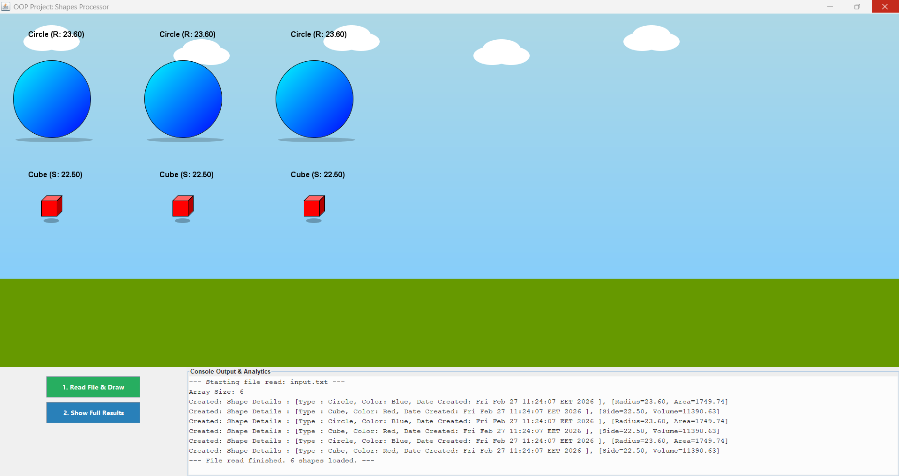

# OOP-Shapes-Processor-Java

Java-based OOP system to process and visualize geometric data. Features advanced Data Ingestion from files, Abstraction, and Interfaces to manage 2D/3D shapes. Includes a custom GUI for real-time analytics and rigorous error handling, ensuring a production-ready software architecture
